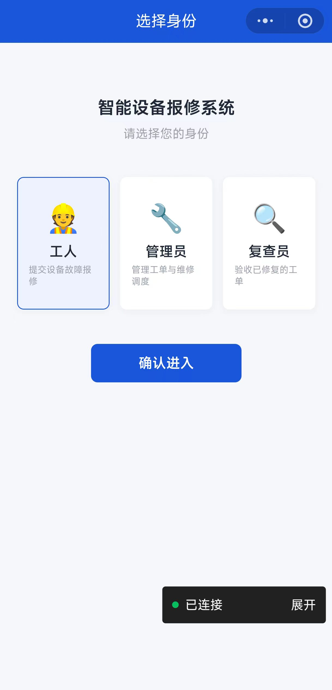
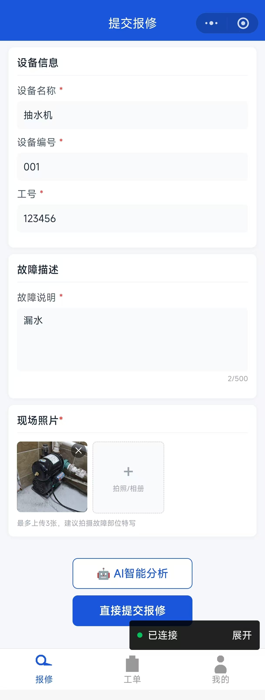
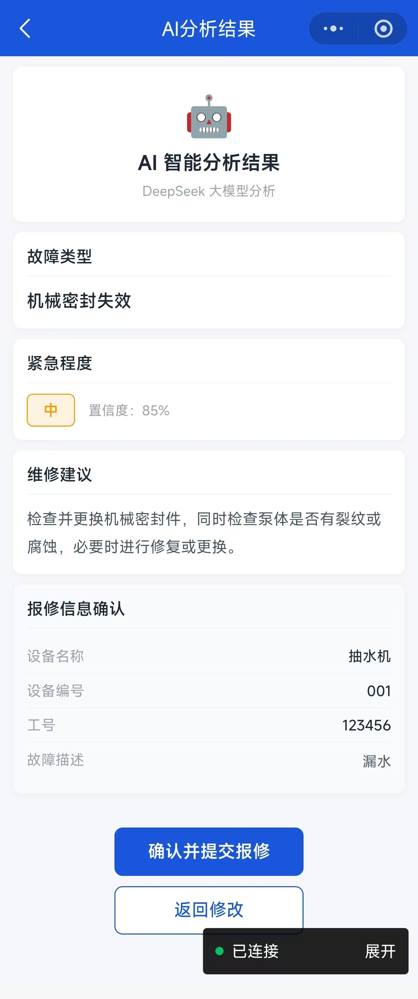
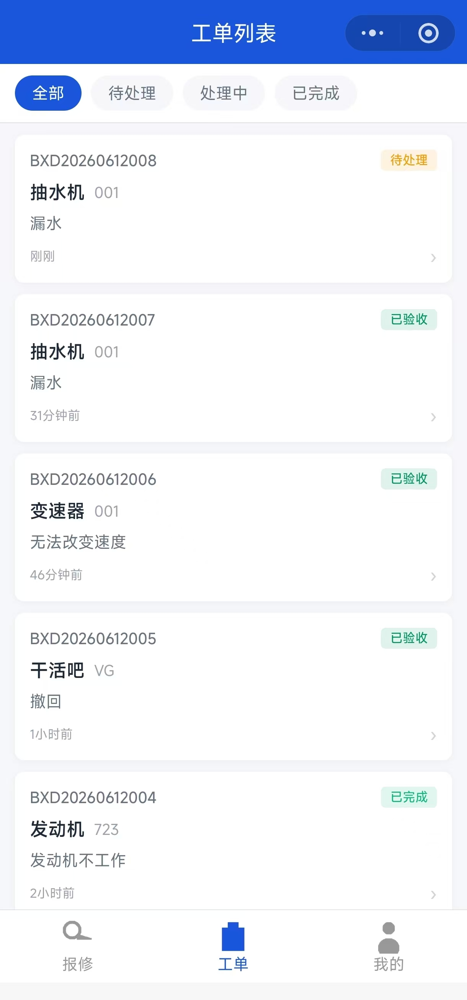
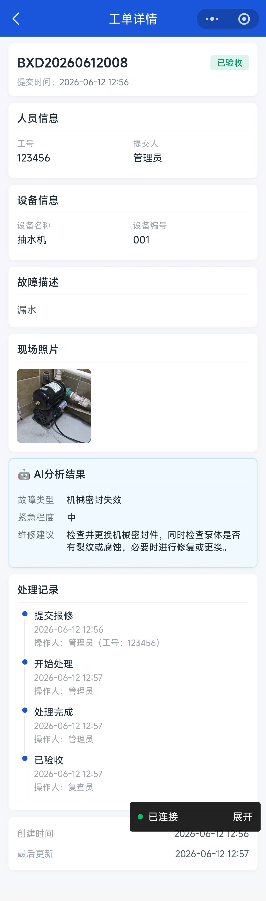
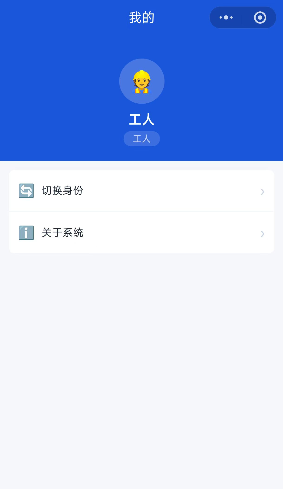

# 智能设备报修系统

基于微信小程序的工厂设备故障报修与处理平台，覆盖「工人报修 → 管理员调度 → 复查员验收」完整工单流转，并接入 DeepSeek 大模型实现 AI 智能故障分析。

> 作者：[@xinlan-lgtm](https://github.com/xinlan-lgtm)

---

## ✨ 功能特性

### 👥 三种角色协同

| 角色 | 职责 | 核心操作 |
|------|------|----------|
| **工人** | 发现设备故障，提交报修工单 | 填写设备信息、上传现场照片、AI 智能分析、直接提交 |
| **管理员** | 工单调度与进度管理 | 查看全部工单、筛选状态、手动修改工单状态 |
| **复查员** | 修复完成后验收把关 | 查看待复查工单、确认验收通过、打回重修 |

### 🔄 完整工单流转

```
工人提交报修
    ↓
 [待处理] ──→ [处理中] ──→ [已完成] ──→ [已验收]
                  ↑                        │
                  └──── 打回重修 ──────────┘
```

- 每条工单记录完整的状态流转日志（操作人、时间、备注）
- 管理员可随时手动调整工单状态
- 复查员验收不通过可附原因打回，工单重回「处理中」
- 已验收工单锁定，禁止修改

### 🤖 AI 智能分析

- 调用 **DeepSeek API** 对故障描述进行智能分析
- 自动识别故障类型、判断紧急程度、给出维修建议和置信度
- 分析结果随工单保存，管理员和复查员可在详情页查看

---

## 🛠 技术栈

| 层级 | 技术选型 | 说明 |
|------|----------|------|
| 前端框架 | 微信小程序原生 JS | 无第三方框架，纯原生开发 |
| UI 样式 | WXSS + 自定义工具类 | 全局样式变量、通用组件类 |
| AI 服务 | DeepSeek Chat API | 故障分析与诊断建议 |
| 数据存储 | 微信本地 Storage | 模拟数据库，存用户身份和工单数据 |
| 图标生成 | Python + PNG | `gen_icons.py` 程序化生成 tabBar 图标 |

---

## 📸 项目截图

> *以下为占位图，请替换为实际项目截图*

| 角色选择 | 提交报修 | AI分析结果 |
|:---:|:---:|:---:|
|  |  |  |

| 工单列表 | 工单详情 | 个人中心 |
|:---:|:---:|:---:|
|  |  |  |

---

## 🚀 快速开始

### 前置条件

1. 安装 [微信开发者工具](https://developers.weixin.qq.com/miniprogram/dev/devtools/download.html)
2. 注册微信小程序并获取 AppID（或使用测试号）
3. 注册 [DeepSeek](https://platform.deepseek.com) 账号并获取 API Key

### 本地运行

```bash
# 1. 克隆仓库
git clone https://github.com/xinlan-lgtm/smart-device-repair.git
cd smart-device-repair

# 2. 配置 DeepSeek API Key
cp config.example.js utils/config.js
# 编辑 utils/config.js，将 API_KEY 替换为你的真实 Key

# 3. 使用微信开发者工具打开项目目录
#    选择「导入项目」→ 选择 smart-device-repair 文件夹 → 填入 AppID

# 4. 生成 tabBar 图标（可选，项目已内置图标）
python gen_icons.py
```

### 配置说明

项目通过 `utils/constants.js` 中的 `DEEPSEEK_CONFIG` 对象管理 API 配置：

```js
const DEEPSEEK_CONFIG = {
  BASE_URL: 'https://api.deepseek.com',
  MODEL: 'deepseek-chat',
  API_KEY: 'your-deepseek-api-key-here'  // ← 替换为你的真实 Key
}
```

> ⚠️ **安全提醒**：API Key 属于敏感信息，`utils/constants.js` 已在 `.gitignore` 中忽略，请勿将真实 Key 提交到版本库。

---

## 📁 目录结构

```
baoxiuXT/
├── app.js                        # 小程序入口，全局状态管理（角色、登录）
├── app.json                      # 小程序配置（页面路由、tabBar、窗口样式）
├── app.wxss                      # 全局样式（按钮、卡片、工具类）
├── config.example.js             # DeepSeek 配置示例（不含真实 Key）
├── gen_icons.py                  # Python 脚本，程序化生成 tabBar 图标
├── project.config.json           # 微信开发者工具项目配置
├── sitemap.json                  # 站点地图
│
├── pages/                        # 页面目录
│   ├── login/                    # 角色选择 / 登录页
│   ├── repair/                   # 提交报修页（工人端核心页面）
│   ├── orders/                   # 工单列表页（支持按状态筛选）
│   ├── order-detail/             # 工单详情页（含管理员/复查员操作入口）
│   ├── ai-result/                # AI 分析结果展示页
│   └── mine/                     # 个人中心（身份切换、关于系统）
│
├── models/
│   └── order.js                  # 工单数据模型（CRUD、状态流转、打回/验收）
│
├── utils/
│   ├── api.js                    # DeepSeek API 调用封装（含图片和纯文本两种模式）
│   ├── constants.js              # 常量定义（状态枚举、角色枚举、API 配置）
│   ├── storage.js                # 本地 Storage 封装（读/写/删/清除）
│   └── util.js                   # 通用工具（工单号生成、时间格式化、图片转 Base64）
│
├── styles/
│   └── common.wxss               # 公共样式变量和工具类（圆角、间距、弹性布局、文字）
│
├── images/
│   └── icons/                    # tabBar 图标（PNG，81×81）
│
└── components/                   # 自定义组件目录（预留）
```

---

## 📝 License

MIT

---

🤖 *Generated with [Claude Code](https://claude.com/claude-code)*
